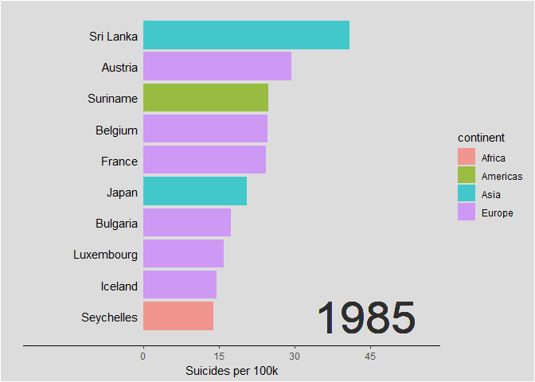

# Bar Chart Race

This repo is the final project of "Statistics Software & Drawing"

## Programming language 
R

## Library
Please install packages before using library()  
For example:
```
install.packages("ggplot2")
```
Use library

```
library(ggplot2)
library(tidyverse) # general
library(ggalt) # dumbbell plots
library(countrycode) # continent
library(rworldmap) # quick country-level heat maps
library(gridExtra) # plots
library(broom) # significant trends within countries
library(gganimate)
```

## Get the plot & download the GIF
Press "Knit" in rmd file to get the html file or download the html file


